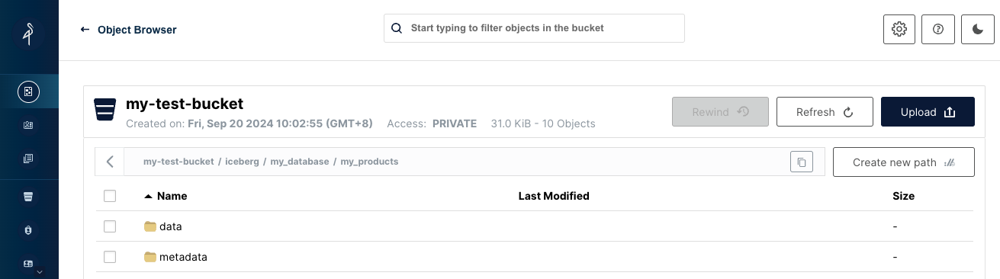

# 通过Docker Compose和k8s部署Minio + Flink + Iceberg

Use the docker-compose.yml file to create a MinIO and a MariaDB database and an Apache Flink Job and Task manager to work with.

## 通过docker部署

```
docker compose up -d
```


Once the containers are running, submit the job to Flink using:

```
docker exec -it jobmanager /opt/flink/bin/sql-client.sh embedded -f /opt/flink/job.sql
```

If you open your browser to `http://localhost:8081` you'll see the Flink UI with your job running, saving the data from the database to s3 using the Iceberg format


The data in MinIO will be in a folder named after the database, in Parquet format.




## 通过k8s部署
* 先将jar打包到docker镜像
```
docker build -t your-docker-repo/flink-custom:1.18.0 .
docker push your-docker-repo/flink-custom:1.18.0
```
* 修改配置文件

将conf-k8s/flink-deployment.yaml中的your-docker-repo替换成自己的镜像仓库地址

* 依次部署mariadb, minio和flink（含iceberg）
```
kubectl apply -f conf-k8s/mariadb.yaml
kubectl apply -f conf-k8s/minio.yaml
kubectl apply -f conf-k8s/flink-configmap.yaml
kubectl apply -f conf-k8s/flink-deployment.yaml
```